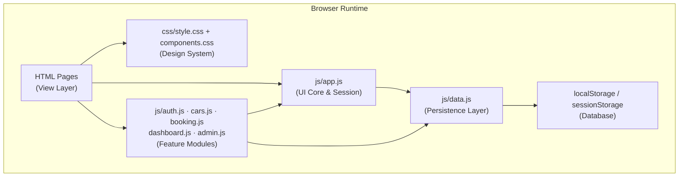
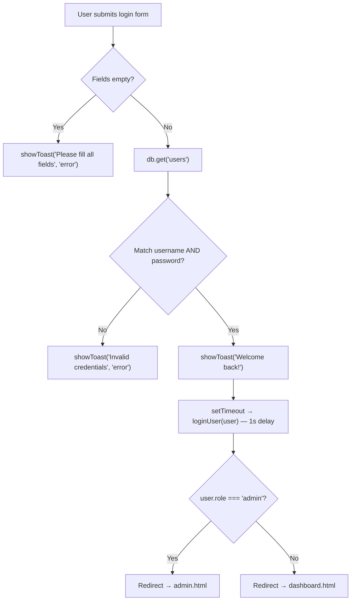
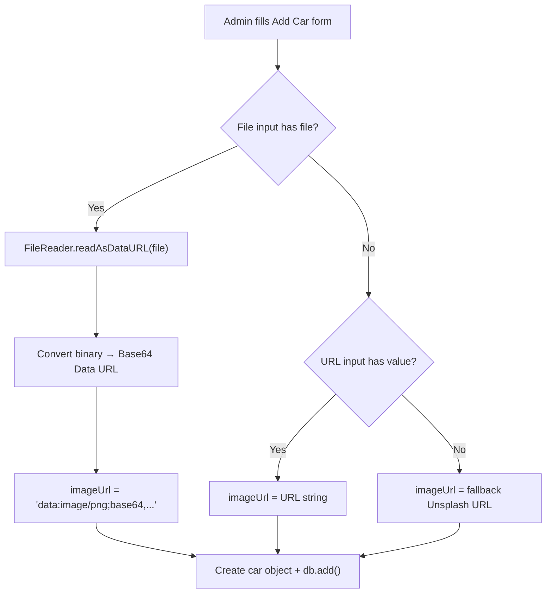
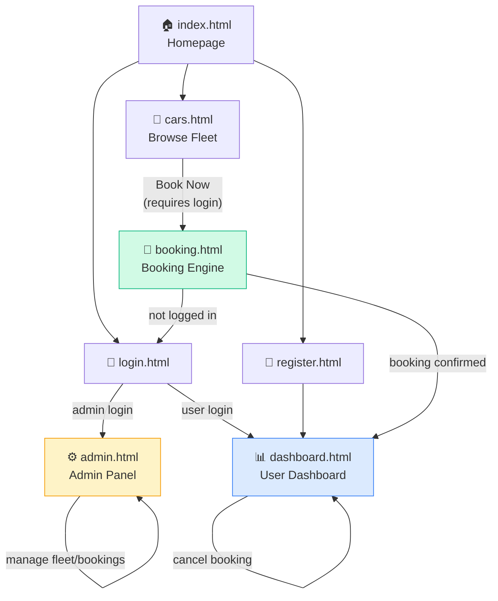

# EliteWheels — Coding & Implementation Document

> **Project**: EliteWheels (LuxRentals) — Online Car Rental System  
> **Stack**: HTML5 · CSS3 · Vanilla JavaScript (ES6+)  
> **Storage**: Web Storage API (`localStorage` / `sessionStorage`)  
> **Last Updated**: April 2026

---

## Table of Contents

1. [Project Overview](#1-project-overview)
2. [Technical Stack & Tools](#2-technical-stack--tools)
3. [System Architecture](#3-system-architecture)
4. [Project File Structure](#4-project-file-structure)
5. [Data Schema & Storage Design](#5-data-schema--storage-design)
6. [Module-by-Module Code Walkthrough](#6-module-by-module-code-walkthrough)
   - 6.1 [Persistence Layer — `data.js`](#61-persistence-layer--datajs)
   - 6.2 [UI Core — `app.js`](#62-ui-core--appjs)
   - 6.3 [Authentication — `auth.js`](#63-authentication--authjs)
   - 6.4 [Fleet Browser — `cars.js`](#64-fleet-browser--carsjs)
   - 6.5 [Booking Engine — `booking.js`](#65-booking-engine--bookingjs)
   - 6.6 [User Dashboard — `dashboard.js`](#66-user-dashboard--dashboardjs)
   - 6.7 [Admin Panel — `admin.js`](#67-admin-panel--adminjs)
7. [CSS Design System](#7-css-design-system)
8. [HTML Page Breakdown](#8-html-page-breakdown)
9. [User Flow & Navigation](#9-user-flow--navigation)
10. [Security Considerations](#10-security-considerations)
11. [Developer Extension Guide](#11-developer-extension-guide)

---

## 1. Project Overview

EliteWheels is a **fully client-side, serverless** car rental web application. It simulates a complete rental platform — including user registration, fleet browsing, real-time booking with payment simulation, user dashboards, and an admin control panel — all without a backend server.

### Key Features

| Feature | Description |
|---|---|
| **User Registration & Login** | Full registration with name, email, phone, address, license, and credentials. Session-aware login with redirect based on role. |
| **Fleet Browser with Filters** | Real-time search by brand/model, filter by vehicle type, and max price/day slider. |
| **Booking Engine** | Date-range picker with live cost calculation (inclusive day count), payment method selection, and confirmation modal. |
| **User Dashboard** | Tabbed interface showing active bookings, booking history, and payment receipts. Supports booking cancellation. |
| **Admin Panel** | Role-gated management console with KPI stats, fleet CRUD operations (including file upload), and booking override controls. |
| **Dark/Light Theming** | System-preference-aware theme toggle with persistent state via `localStorage`. |
| **Auto-Migration System** | Self-patching IIFE functions that sync local cached data with source code changes on every page load. |

---

## 2. Technical Stack & Tools

| Layer | Technology | Features Used |
|---|---|---|
| **Markup** | HTML5 | Semantic elements (`<main>`, `<nav>`, `<aside>`, `<footer>`), native form validation (`required`, `type`), SVG icons |
| **Styling** | CSS3 | Custom Properties (design tokens), Flexbox, CSS Grid, `backdrop-filter` (glassmorphism), transitions, keyframe animations |
| **Logic** | JavaScript ES6+ | Template literals, arrow functions, `async/await`, destructuring, spread operator, `URLSearchParams`, `FileReader` API |
| **Persistence** | Web Storage API | `localStorage` for database + theme + session (remember me), `sessionStorage` for ephemeral login sessions |
| **Typography** | Google Fonts | [Outfit](https://fonts.google.com/specimen/Outfit) — weights 300–700 |

> [!NOTE]
> The application has **zero external JavaScript dependencies**. All logic is implemented with vanilla JS. The only external resource is the Google Fonts stylesheet.

---

## 3. System Architecture

The project follows a **Layered Modular Monolith** pattern on the client side. Each layer has a distinct responsibility:



### Layer Responsibilities

| Layer | Files | Role |
|---|---|---|
| **Persistence** | `data.js` | Initializes the database, exposes the `db` CRUD adapter and `utils` helper object, runs auto-migration patches |
| **UI Core** | `app.js` | Session management (`getCurrentUser`, `loginUser`, `logoutUser`), toast notifications, theme engine, dynamic navbar/footer injection |
| **Feature Modules** | `auth.js`, `cars.js`, `booking.js`, `dashboard.js`, `admin.js` | Page-specific business logic. Each module is loaded only on its corresponding HTML page |
| **View** | `*.html` | Structural markup with placeholders for dynamic injection |
| **Design System** | `style.css`, `components.css` | Design tokens, theme variables, reusable UI component styles |

### Script Loading Order

Every HTML page loads scripts in a strict dependency order:

```
1. js/data.js      →  Database init + db adapter + utils
2. js/app.js       →  Session + theme + navbar/footer (depends on db)
3. js/<module>.js  →  Feature logic (depends on db + app globals)
```

> [!IMPORTANT]
> This load order is **critical**. `data.js` must execute first to ensure `db` and `utils` are available globally. `app.js` must follow to provide `getCurrentUser()`, `showToast()`, and `loginUser()` before any feature module accesses them.

---

## 4. Project File Structure

```
EliteWheels/
├── index.html              # Homepage — hero section + 3 featured cars
├── cars.html               # Fleet browser — search, type filter, price filter
├── booking.html            # Booking engine — date picker, payment, confirmation
├── dashboard.html          # User dashboard — tabs: active, history, payments
├── admin.html              # Admin panel — stats, fleet table, bookings table, modals
├── login.html              # Login form — username/password
├── register.html           # Registration form — 8 fields, 2-column grid
│
├── css/
│   ├── style.css           # Design tokens, theme variables, reset, utilities
│   └── components.css      # Navbar, buttons, forms, cards, grid, toasts,
│                           #   footer, modals (307 lines)
│
├── js/
│   ├── data.js             # Database init, db adapter, utils, migration patches
│   ├── app.js              # Session mgmt, toast UI, theme, navbar/footer render
│   ├── auth.js             # Login/register form handlers
│   ├── cars.js             # Filter engine + car card rendering
│   ├── booking.js          # Date calculation, booking/payment creation
│   ├── dashboard.js        # Tab switching, booking/payment list rendering
│   └── admin.js            # Stats, fleet CRUD, booking overrides
│
├── assets/
│   └── images/             # Local vehicle images (PNG, ~0.5–1.1 MB each)
│       ├── bmw.png
│       ├── civic.png
│       ├── jeep.png
│       ├── mustang.png
│       ├── nexon.png
│       ├── porsche.png
│       ├── swift.png
│       ├── tesla.png
│       └── thar.png
│
└── README.md               # Project documentation
```

### File Size Summary

| Category | Files | Total Size |
|---|---|---|
| HTML Pages | 7 | ~25.9 KB |
| CSS Stylesheets | 2 | ~7.5 KB |
| JavaScript Modules | 7 | ~31.9 KB |
| Image Assets | 9 | ~7.4 MB |
| **Total Codebase (excl. images)** | **16** | **~65.3 KB** |

---

## 5. Data Schema & Storage Design

All application data is stored as **JSON-serialized arrays** in `localStorage`. The system manages four collections:

### 5.1 Collections Overview

| Collection Key | Type | Description |
|---|---|---|
| `cars` | `Vehicle[]` | Fleet inventory |
| `users` | `User[]` | Registered users (including admin) |
| `bookings` | `Booking[]` | Rental reservations |
| `payments` | `Payment[]` | Transaction records |

### 5.2 Vehicle Schema

```javascript
{
    id: "c_1",                          // Unique ID — prefix "c_"
    brand: "Tesla",                     // Manufacturer name
    model: "Model S",                   // Vehicle model
    year: 2023,                         // Model year (integer)
    type: "Electric",                   // Category: Electric | Sports | Sedan | SUV | Hatchback
    price_per_day: 10000,               // Daily rate in INR (integer)
    availability: true,                 // Booking availability flag
    image: "assets/images/tesla.png"    // Relative path or Base64 data URL
}
```

### 5.3 User Schema

```javascript
{
    id: "u_abc123def",                  // Generated ID — prefix "u_"
    name: "John Doe",                   // Full name
    email: "john@example.com",          // Email address
    phone: "9876543210",                // Phone number
    address: "Mumbai, India",           // Physical address
    license: "MH-1234567890",           // Driving license number
    username: "johndoe",                // Login username
    password: "mypassword",             // Plain-text password (simulation)
    role: "user"                        // Role: "user" | "admin"
}
```

### 5.4 Booking Schema

```javascript
{
    booking_id: "b_xyz789abc",          // Generated ID — prefix "b_"
    user_id: "u_abc123def",             // FK → users.id
    car_id: "c_1",                      // FK → cars.id
    pickup_date: "2026-04-10",          // ISO date string
    return_date: "2026-04-15",          // ISO date string
    total_amount: 60000,                // Calculated: days × price_per_day (INR)
    status: "Confirmed"                 // Status: "Confirmed" | "Cancelled"
}
```

### 5.5 Payment Schema

```javascript
{
    payment_id: "p_mno456pqr",          // Generated ID — prefix "p_"
    booking_id: "b_xyz789abc",          // FK → bookings.booking_id
    amount: 60000,                      // Amount in INR
    method: "Card",                     // Method: "Card" | "UPI" | "Cash"
    status: "Success",                  // Always "Success" (simulated)
    date: "2026-04-05T16:30:00.000Z"    // ISO datetime string
}
```

### 5.6 Additional Storage Keys

| Key | Storage | Type | Description |
|---|---|---|---|
| `theme` | `localStorage` | `"light" \| "dark"` | User's theme preference |
| `currentUser` | `localStorage` or `sessionStorage` | `User` (JSON) | Active session. Location depends on "Remember Me" |

---

## 6. Module-by-Module Code Walkthrough

### 6.1 Persistence Layer — [data.js](file:///e:/Web%20Dev%20Projects/CarRental/js/data.js)

**Purpose**: Acts as the application's "mock backend." Initializes the database, provides a standardized CRUD adapter, and runs auto-migration patches.

#### A. Seed Data — `DUMMY_CARS` (Lines 1–92)

A constant array of 9 pre-configured vehicles forming the default fleet:

| ID | Brand | Model | Type | Price/Day (₹) |
|---|---|---|---|---|
| c_1 | Tesla | Model S | Electric | 10,000 |
| c_2 | Ford | Mustang GT | Sports | 1,50,000 |
| c_3 | Honda | Civic | Sedan | 3,800 |
| c_4 | BMW | X5 | SUV | 9,200 |
| c_5 | Jeep | Wrangler | SUV | 6,700 |
| c_6 | Porsche | 911 Carrera | Sports | 25,200 |
| c_7 | Maruti Suzuki | Swift | Hatchback | 1,500 |
| c_8 | Tata | Nexon | SUV | 2,500 |
| c_9 | Mahindra | Thar | SUV | 3,500 |

#### B. Database Initialization — `initializeDatabase()` (Lines 94–122)

```javascript
function initializeDatabase() {
    if (!localStorage.getItem("cars"))     → seed DUMMY_CARS
    if (!localStorage.getItem("users"))    → seed admin user
    if (!localStorage.getItem("bookings")) → seed empty array
    if (!localStorage.getItem("payments")) → seed empty array
}
initializeDatabase(); // Invoked immediately
```

**Logic**: Uses existence checks (`!localStorage.getItem(...)`) to ensure data is only seeded on first visit. On subsequent visits, existing data is preserved.

**Default Admin Account**:
- Username: `admin`
- Password: `adminpassword`
- Role: `admin`

#### C. Database Adapter — `db` Object (Lines 125–146)

A global CRUD utility object providing four methods:

| Method | Signature | Description |
|---|---|---|
| `db.get(collection)` | `(string) → Array` | Deserializes and returns the collection array |
| `db.set(collection, data)` | `(string, Array) → void` | Serializes and overwrites the collection |
| `db.add(collection, item)` | `(string, Object) → void` | Appends an item to the collection |
| `db.update(collection, id, updatedItem)` | `(string, string, Object) → void` | Finds by `id`, `booking_id`, or `payment_id` and merges updates via spread |
| `db.remove(collection, id)` | `(string, string) → void` | Filters out the item matching the id |

> [!TIP]
> The `update` method uses `findIndex` with a triple-fallback ID check (`i.id === id || i.booking_id === id || i.payment_id === id`) to work across all collection types with a single function.

#### D. Utility Functions — `utils` Object (Lines 148–152)

| Method | Description |
|---|---|
| `utils.generateId(prefix)` | Generates a random alphanumeric ID like `b_k7xm2np4q` |
| `utils.formatDate(dateString)` | Formats ISO date to locale string via `toLocaleDateString()` |
| `utils.formatCurrency(amount)` | Formats number as `₹X,XX,XXX.XX` using `toLocaleString('en-IN')` |

#### E. Auto-Migration Patches (Lines 154–194)

Two self-executing IIFEs run on every page load:

**1. `patchPrices()` (Lines 155–176)** — Syncs prices and adds new cars:
```
For each car in localStorage:
    If its price differs from DUMMY_CARS → overwrite with source price
For each car in DUMMY_CARS:
    If not found in localStorage → append it
```

**2. `patchBrokenImages()` (Lines 179–194)** — Fixes legacy external URLs:
```
For each car in localStorage:
    If image URL contains "unsplash.com" → replace with local asset path
```

> [!IMPORTANT]
> These migrations ensure that when a developer updates `DUMMY_CARS` (e.g., changes a price or adds a new vehicle), existing users will automatically receive the updated data on their next page load — without needing to clear their browser storage.

---

### 6.2 UI Core — [app.js](file:///e:/Web%20Dev%20Projects/CarRental/js/app.js)

**Purpose**: Manages the global application state — session lifecycle, UI feedback, theming, and shared component rendering.

#### A. Session Management (Lines 1–17)

| Function | Description |
|---|---|
| `getCurrentUser()` | Checks `sessionStorage` first, then `localStorage` for `currentUser`. Returns parsed object or `null` |
| `loginUser(user, remember)` | Stores user in `sessionStorage` (default) or `localStorage` (if remember=true). Redirects to `admin.html` for admins, `dashboard.html` for users |
| `logoutUser()` | Clears `currentUser` from both storages. Redirects to `index.html` |

**Session Hierarchy**: `sessionStorage` takes priority over `localStorage` to ensure tab-scoped sessions when "Remember Me" is not selected.

#### B. Toast Notification System (Lines 20–42)

```javascript
showToast(message, type = 'success')
```

- Dynamically creates a `#toast-container` (fixed bottom-right) if it doesn't exist
- Spawns a toast `<div>` with CSS class `toast-success` or `toast-error`
- Animates in with `requestAnimationFrame` → `.show` class
- Auto-removes after **3 seconds** with a fade-out transition

#### C. Theme Engine (Lines 44–57)

| Function | Logic |
|---|---|
| `toggleTheme()` | Reads current `data-theme` from `<html>`, flips it, saves to `localStorage` |
| `initTheme()` | On load: checks `localStorage` for saved theme, falls back to `prefers-color-scheme` media query |

The theme operates entirely via the `data-theme` attribute on `<html>`, which triggers CSS Custom Property overrides defined in `style.css`.

#### D. Dynamic Navbar Injection (Lines 60–114)

`renderNavbar()` injects the navigation bar into `#navbar-placeholder`. The nav links are **role-aware**:

| User State | Links Shown |
|---|---|
| Not logged in | Home, Cars, **Login**, **Register** |
| Logged in (user) | Home, Cars, **Dashboard**, **Logout** |
| Logged in (admin) | Home, Cars, **Admin Panel**, **Logout** |

The `highlightCurrentPage()` helper adds an `active` CSS class to the nav link matching the current page URL.

#### E. Footer Injection (Lines 117–135)

`renderFooter()` injects a standardized footer with brand, links (Home, Fleet, Contact Us), and copyright notice.

#### F. Page Load Bootstrap (Lines 138–142)

```javascript
document.addEventListener("DOMContentLoaded", () => {
    initTheme();
    renderNavbar();
    renderFooter();
});
```

This runs on **every page** since `app.js` is included globally.

---

### 6.3 Authentication — [auth.js](file:///e:/Web%20Dev%20Projects/CarRental/js/auth.js)

**Purpose**: Handles login and registration form submissions.

#### Login Flow (`handleLogin`, Lines 13–33)



#### Registration Flow (`handleRegister`, Lines 35–65)

**Validation steps**:
1. Password match check (`password === confirmPassword`)
2. Duplicate check (username OR email already exists)
3. If valid → creates `User` object with `utils.generateId("u")`
4. Adds to `users` collection via `db.add()`
5. Auto-login after **1.5 seconds**

**Registration fields**: name, email, phone, address, license, username, password, confirmPassword

---

### 6.4 Fleet Browser — [cars.js](file:///e:/Web%20Dev%20Projects/CarRental/js/cars.js)

**Purpose**: Real-time filtering and rendering of the vehicle catalog.

#### Filter Engine — `applyFilters()` (Lines 38–51)

Applies three concurrent filters via `Array.filter()`:

```javascript
const filtered = cars.filter(car => {
    matchesSearch: car.brand or car.model includes searchTerm (case-insensitive)
    matchesType:   type === "All" OR car.type === selected type
    matchesPrice:  car.price_per_day <= maxPrice (default: Infinity)
    return matchesSearch && matchesType && matchesPrice;
});
```

**Event binding** (Lines 53–56): All three filter inputs (`searchInput`, `typeFilter`, `priceFilter`) trigger `applyFilters()` in real-time on `input` or `change` events.

#### Card Rendering — `renderCars()` (Lines 9–36)

Each car is rendered as a card with:
- Vehicle image (`` with lazy loading)
- Brand + Model title
- Year and type specs (emoji-decorated)
- Price formatted as ₹/day
- **"Book Now"** button (if available) or **"Unavailable"** disabled button

---

### 6.5 Booking Engine — [booking.js](file:///e:/Web%20Dev%20Projects/CarRental/js/booking.js)

**Purpose**: Handles the complete booking transaction — from date selection to payment recording.

#### Access Control (Lines 1–24)

Three guard checks before the page renders:
1. **Auth guard**: If no user session → toast error + redirect to `login.html`
2. **Car ID check**: If no `?car=` URL param → redirect to `cars.html`
3. **Availability check**: If car not found OR `availability === false` → redirect to `cars.html`

#### Date Calculation — `calculateTotal()` (Lines 57–75)

```javascript
const diffTime = endDate - startDate;
const diffDays = Math.ceil(diffTime / (1000 * 60 * 60 * 24)) + 1; // INCLUSIVE
const totalAmount = diffDays * car.price_per_day;
```

> [!NOTE]
> The `+ 1` makes the calculation **inclusive** — a rental from April 10 to April 15 counts as **6 days**, not 5. Both pickup and return days are charged.

**Validation**: If `start > end`, the return date is cleared and a toast error is shown.

**Dynamic min-date**: `pickupDate.min` is set to today's date. When a pickup date is chosen, `returnDate.min` is updated to match.

#### Booking Submission (Lines 84–139)

On form submit:

1. **Validate** date range (`diffDays > 0`)
2. **Create Booking** object → `db.add("bookings", newBooking)`
3. **Create Payment** object → `db.add("payments", newPayment)`
4. **Mark car unavailable** → `db.update("cars", car.id, { availability: false })`
5. **Show success modal** → `#successModal.classList.add("active")`
6. **Redirect** to `dashboard.html` after 2 seconds

---

### 6.6 User Dashboard — [dashboard.js](file:///e:/Web%20Dev%20Projects/CarRental/js/dashboard.js)

**Purpose**: Displays the user's booking and payment history with tab navigation.

#### Data Segmentation (Lines 12–19)

```javascript
const allBookings = db.get("bookings").filter(b => b.user_id === user.id);
const today = new Date().toISOString().split('T')[0];

const activeBookings  = allBookings.filter(b => b.return_date >= today && b.status === "Confirmed");
const historyBookings = allBookings.filter(b => b.return_date < today  || b.status === "Cancelled");
```

| Tab | Content | Filter Logic |
|---|---|---|
| **Active Bookings** | Current rentals with cancel button | Return date ≥ today AND status = "Confirmed" |
| **Booking History** | Past and cancelled rentals | Return date < today OR status = "Cancelled" |
| **Payment History** | All payment receipts | Payments whose `booking_id` matches any of the user's bookings |

#### Tab Switching — `switchTab()` (Lines 83–89)

Hides all `.tab-content` elements, shows the selected one, and toggles the `active` class on tab buttons.

#### Booking Cancellation — `cancelBooking()` (Lines 91–98)

```javascript
1. confirm() dialog
2. db.update("bookings", bookingId, { status: "Cancelled" })
3. db.update("cars", carId, { availability: true })    // Re-enables the car
4. showToast + page reload after 1.5s
```

---

### 6.7 Admin Panel — [admin.js](file:///e:/Web%20Dev%20Projects/CarRental/js/admin.js)

**Purpose**: Comprehensive fleet and booking management for administrators.

#### Access Control (Lines 1–6)

```javascript
if (!user || user.role !== 'admin') → redirect to login.html
```

Double-guard: must be logged in AND must have `role === "admin"`.

#### KPI Statistics (Lines 12–16)

| Stat | Calculation |
|---|---|
| Total Bookings | `bookings.length` |
| Total Revenue | `payments.reduce(...)` — sums amounts where `status === "Success"` |
| Fleet Size | `cars.length` |

#### Fleet Management Table (Lines 18–39)

Each car row includes three action buttons:
- **Edit** → Opens `#editCarModal` pre-filled with car data
- **Toggle** → Flips `availability` boolean
- **Delete** → Removes car from collection (with confirm dialog)

#### Add Car — Image Upload Flow (Lines 60–87)



> [!TIP]
> The `FileReader` API converts uploaded images to **Base64 Data URLs**, allowing them to be stored as strings in `localStorage`. This enables image persistence without any server-side storage — though it increases the storage footprint significantly (~1.3x the original file size due to Base64 encoding).

#### Edit Car Modal (Lines 98–137)

- `openEditModal(id)` populates all form fields from the existing car data
- On submit, merges updates via `db.update("cars", id, updatedCar)`
- Image is only updated if a new URL or file is provided

#### Admin Booking Override (Lines 148–155)

```javascript
cancelBookingAdmin(bookingId, carId)
```

Allows admin to cancel any user's booking — same logic as user cancellation but without ownership restriction.

---

## 7. CSS Design System

### 7.1 Design Tokens — [style.css](file:///e:/Web%20Dev%20Projects/CarRental/css/style.css)

The theme system uses CSS Custom Properties (variables) on the `:root` and `[data-theme="dark"]` selectors:

| Token | Light Mode | Dark Mode | Usage |
|---|---|---|---|
| `--bg-color` | `#f8fafc` | `#0f172a` | Page background |
| `--card-bg` | `#ffffff` | `#1e293b` | Card/surface backgrounds |
| `--text-primary` | `#0f172a` | `#f8fafc` | Headings, body text |
| `--text-secondary` | `#64748b` | `#94a3b8` | Labels, metadata |
| `--primary-color` | `#3b82f6` | `#3b82f6` | Buttons, links, accents |
| `--primary-hover` | `#2563eb` | `#60a5fa` | Button hover states |
| `--border-color` | `#e2e8f0` | `#334155` | Card borders, dividers |
| `--danger-color` | `#ef4444` | `#ef4444` | Error states, delete buttons |
| `--success-color` | `#10b981` | `#10b981` | Success states, confirmations |
| `--card-shadow` | Light shadow | Deep shadow | Card elevation |
| `--glass-bg` | `rgba(255,255,255,0.8)` | `rgba(30,41,59,0.7)` | Navbar glassmorphism |
| `--glass-border` | `rgba(255,255,255,0.3)` | `rgba(255,255,255,0.1)` | Navbar border |

### 7.2 Global Reset & Typography

```css
* {
    margin: 0; padding: 0; box-sizing: border-box;
    font-family: 'Outfit', sans-serif;
    transition: background-color 0.3s ease, color 0.3s ease; /* Smooth theme switching */
}
```

### 7.3 Component Library — [components.css](file:///e:/Web%20Dev%20Projects/CarRental/css/components.css)

| Component | Key Styles |
|---|---|
| **Navbar** | `position: sticky`, `backdrop-filter: blur(10px)`, glassmorphism effect |
| **Buttons** | 3 variants: `.btn-primary` (blue fill), `.btn-secondary` (outline), `.btn-danger` (red fill). Scale-down on `:active` |
| **Form Controls** | Border radius 8px, focus state with blue ring (`box-shadow: 0 0 0 3px`) |
| **Cards** | 12px border-radius, shadow elevation, hover lift (`translateY(-5px)`) |
| **Grid** | `auto-fill, minmax(300px, 1fr)` responsive grid |
| **Toasts** | Fixed position, slide-in from right, color-coded left border |
| **Footer** | Flex links, centered brand, copyright line |
| **Modals** | Backdrop blur overlay, centered content, slide-up animation on `.active` |

### 7.4 Utility Classes

```css
.text-center    { text-align: center; }
.mb-1           { margin-bottom: 0.5rem; }
.mb-2           { margin-bottom: 1rem; }
.mb-3           { margin-bottom: 1.5rem; }
.mt-2           { margin-top: 1rem; }
.mt-3           { margin-top: 1.5rem; }
.fade-in        { animation: fadeIn 0.4s ease-out forwards; }
```

---

## 8. HTML Page Breakdown

### 8.1 [index.html](file:///e:/Web%20Dev%20Projects/CarRental/index.html) — Homepage

| Section | Content |
|---|---|
| Hero | Gradient background, headline "Drive Your Dream Car Today", CTA → `cars.html` |
| Featured Vehicles | Top 3 cars from `db.get("cars").slice(0, 3)`, rendered inline via `<script>` |

### 8.2 [cars.html](file:///e:/Web%20Dev%20Projects/CarRental/cars.html) — Fleet Browser

| Section | Content |
|---|---|
| Filters Bar | Search input, type dropdown (All/Sedan/SUV/Electric/Sports), max price input |
| Car Grid | All vehicles rendered via `cars.js` with responsive `grid-container` |

### 8.3 [booking.html](file:///e:/Web%20Dev%20Projects/CarRental/booking.html) — Booking Page

| Section | Content |
|---|---|
| Car Summary (sticky sidebar) | Image, name, year/type, rate, live day count, live total |
| Booking Form | Date pickers (pickup/return), payment method dropdown, "Confirm & Pay" button |
| Success Modal | Green checkmark + confirmation message, auto-redirect |

### 8.4 [dashboard.html](file:///e:/Web%20Dev%20Projects/CarRental/dashboard.html) — User Dashboard

| Section | Content |
|---|---|
| Sidebar | User name/email, tab navigation buttons |
| Active Bookings Tab | Car name, dates, total, status badge, cancel button |
| Booking History Tab | Past and cancelled bookings |
| Payment History Tab | Receipt ID, date, method, amount, status |

### 8.5 [admin.html](file:///e:/Web%20Dev%20Projects/CarRental/admin.html) — Admin Panel

| Section | Content |
|---|---|
| Stats Grid | 3 KPI cards: Total Bookings, Total Revenue, Fleet Size |
| Fleet Table | Full car listing with Edit/Toggle/Delete actions |
| Bookings Table | Recent 10 bookings with admin Cancel override |
| Add Car Modal | 6-field form with URL or file upload for image |
| Edit Car Modal | Pre-filled 6-field form for editing existing cars |

### 8.6 [login.html](file:///e:/Web%20Dev%20Projects/CarRental/login.html) — Login

Centered card layout. Username + password fields. Link to registration.

### 8.7 [register.html](file:///e:/Web%20Dev%20Projects/CarRental/register.html) — Registration

2-column grid layout with 8 fields. Password confirmation. Link to login.

---

## 9. User Flow & Navigation



### Access Control Matrix

| Page | Guest | User | Admin |
|---|---|---|---|
| `index.html` | ✅ | ✅ | ✅ |
| `cars.html` | ✅ | ✅ | ✅ |
| `booking.html` | ❌ → login | ✅ | ✅ |
| `dashboard.html` | ❌ → login | ✅ | ❌ (no redirect, but no user data) |
| `admin.html` | ❌ → login | ❌ → login | ✅ |
| `login.html` | ✅ | ✅ | ✅ |
| `register.html` | ✅ | ✅ | ✅ |

---

## 10. Security Considerations

> [!CAUTION]
> This is a **client-side simulation** intended for demonstration purposes. The following limitations apply to any client-only implementation:

| Concern | Current State | Production Recommendation |
|---|---|---|
| **Password Storage** | Plain text in `localStorage` | Hash with bcrypt/argon2 on a server |
| **Session Management** | User object stored in browser storage | Use HTTP-only, secure cookies with server-issued JWTs |
| **Admin Access Control** | Role checked client-side; any user can inspect/modify `localStorage` | Server-enforced RBAC with middleware |
| **Data Integrity** | All data can be modified via browser DevTools | Server-side validation + database constraints |
| **Payment Processing** | Simulated — no actual payment gateway | Integrate Stripe/Razorpay with server-side webhooks |

---

## 11. Developer Extension Guide

### Adding a New Vehicle to the Default Fleet

1. Add an entry to the `DUMMY_CARS` array in [data.js](file:///e:/Web%20Dev%20Projects/CarRental/js/data.js):

```javascript
{
    id: "c_10",
    model: "Creta",
    brand: "Hyundai",
    year: 2024,
    type: "SUV",
    price_per_day: 4500,
    availability: true,
    image: "assets/images/creta.png"
}
```

2. Place the image in `assets/images/`.
3. The `patchPrices()` migration will add the new car to existing users' `localStorage` on their next page load.

### Adding a New Vehicle Type

1. Add the type to the `<select>` in [cars.html](file:///e:/Web%20Dev%20Projects/CarRental/cars.html) (line 38–43):

```html
<option value="Hatchback">Hatchback</option>
```

2. No JavaScript changes needed — the filter engine works dynamically based on `car.type` string matching.

### Modifying the Currency

Update the `formatCurrency` function in [data.js](file:///e:/Web%20Dev%20Projects/CarRental/js/data.js) (line 151):

```javascript
// For USD:
formatCurrency: (amount) => `$${parseFloat(amount).toLocaleString('en-US', { minimumFractionDigits: 2 })}`

// For EUR:
formatCurrency: (amount) => `€${parseFloat(amount).toLocaleString('de-DE', { minimumFractionDigits: 2 })}`
```

### Adding a New Page

1. Create the HTML file with the standard template:

```html
<!DOCTYPE html>
<html lang="en">
<head>
    <meta charset="UTF-8">
    <meta name="viewport" content="width=device-width, initial-scale=1.0">
    <title>Page Title - LuxRentals</title>
    <link rel="stylesheet" href="css/style.css">
    <link rel="stylesheet" href="css/components.css">
</head>
<body>
    <div id="navbar-placeholder"></div>
    <main class="fade-in">
        <!-- Your content -->
    </main>
    <div id="footer-placeholder"></div>
    
    <script src="js/data.js"></script>
    <script src="js/app.js"></script>
    <script src="js/your-module.js"></script>
</body>
</html>
```

2. Create `js/your-module.js` for page-specific logic.
3. Add navigation links in `renderNavbar()` in [app.js](file:///e:/Web%20Dev%20Projects/CarRental/js/app.js) if needed.

---

> **End of Document**  
> This document covers the complete coding and implementation of the EliteWheels Car Rental project. For questions or contributions, refer to the inline code comments within each source file.
