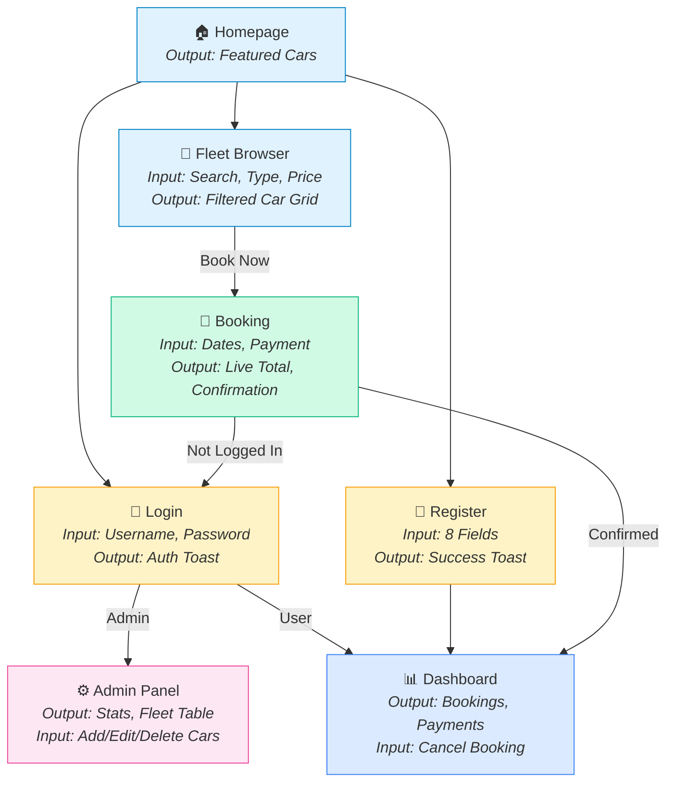

# EliteWheels — Report Design Document
## Input/Output Screen Analysis

> **Project**: EliteWheels (LuxRentals) — Online Car Rental System  
> **Prepared By**: System Documentation  
> **Date**: April 2026  
> **Version**: 1.0

---

## Table of Contents

1. [Introduction](#1-introduction)
2. [Screen Inventory](#2-screen-inventory)
3. [Screen 1 — Homepage](#3-screen-1--homepage-indexhtml)
4. [Screen 2 — Fleet Browser](#4-screen-2--fleet-browser-carshtml)
5. [Screen 3 — User Login](#5-screen-3--user-login-loginhtml)
6. [Screen 4 — User Registration](#6-screen-4--user-registration-registerhtml)
7. [Screen 5 — Booking Engine](#7-screen-5--booking-engine-bookinghtml)
8. [Screen 6 — User Dashboard](#8-screen-6--user-dashboard-dashboardhtml)
9. [Screen 7 — Admin Control Panel](#9-screen-7--admin-control-panel-adminhtml)
10. [System Notifications & Feedback](#10-system-notifications--feedback)
11. [User Flow Summary](#11-user-flow-summary)

---

## 1. Introduction

This document presents the **Report Design** for the EliteWheels Car Rental web application, organized by each screen's input fields and output displays. For every user-facing screen, the following is documented:

- **Screenshot** of the actual screen
- **Input fields** — what the user provides
- **Output displays** — what the system shows
- **Validation rules** — constraints on user input
- **System response** — what happens after submission
- **Sample data** — example values for demonstration

---

## 2. Screen Inventory

| # | Screen Name | File | Access Level | Primary Purpose |
|---|---|---|---|---|
| 1 | Homepage | `index.html` | Public | Landing page, featured vehicles, CTA |
| 2 | Fleet Browser | `cars.html` | Public | Search and filter all vehicles |
| 3 | User Login | `login.html` | Public | Authenticate existing users |
| 4 | User Registration | `register.html` | Public | Create new user accounts |
| 5 | Booking Engine | `booking.html` | Authenticated | Select dates, make payment, confirm booking |
| 6 | User Dashboard | `dashboard.html` | Authenticated | View bookings, payments, cancel rentals |
| 7 | Admin Control Panel | `admin.html` | Admin Only | Manage fleet, view bookings, override operations |

---

## 3. Screen 1 — Homepage (`index.html`)

### 3.1 Screen Capture

````carousel

<!-- slide -->

````

### 3.2 Input Fields

| # | Field | Type | Required | Description |
|---|---|---|---|---|
| — | *No user input fields on this page* | — | — | This is a display-only landing page |

### 3.3 Output Displays

| # | Element | Type | Data Source | Description |
|---|---|---|---|---|
| 1 | Hero Headline | Static Text | Hardcoded | "Drive Your Dream Car Today" |
| 2 | Hero Subtext | Static Text | Hardcoded | Premium vehicle description |
| 3 | "Explore Fleet" Button | Navigation Link | — | Links to `cars.html` |
| 4 | Featured Vehicle Cards (×3) | Dynamic Cards | `db.get("cars").slice(0, 3)` | First 3 cars from the database |
| 5 | Car Image | Image | `car.image` | Vehicle photo |
| 6 | Car Name | Text | `car.brand + car.model` | e.g., "Tesla Model S" |
| 7 | Car Specs | Text | `car.year`, `car.type` | e.g., "🗓️ 2023 🏎️ Electric" |
| 8 | Car Price | Formatted Currency | `utils.formatCurrency(car.price_per_day)` | e.g., "₹10,000.00 / day" |
| 9 | "Book Now" Button | Navigation Link | `car.id` | Links to `booking.html?car={id}` |
| 10 | "View All Cars" Button | Navigation Link | — | Links to `cars.html` |
| 11 | Navigation Bar | Dynamic Component | `getCurrentUser()` | Shows Login/Register or Dashboard/Logout based on auth state |
| 12 | Footer | Static Component | Hardcoded | Brand, links, copyright |

### 3.4 Sample Output Data

| Card | Brand | Model | Year | Type | Price/Day |
|---|---|---|---|---|---|
| 1 | Tesla | Model S | 2023 | Electric | ₹10,000.00 |
| 2 | Ford | Mustang GT | 2022 | Sports | ₹1,50,000.00 |
| 3 | Honda | Civic | 2021 | Sedan | ₹3,800.00 |

---

## 4. Screen 2 — Fleet Browser (`cars.html`)

### 4.1 Screen Capture


### 4.2 Input Fields

| # | Field | Element ID | Type | Required | Default | Description |
|---|---|---|---|---|---|---|
| 1 | Search | `searchInput` | Text Input | No | Empty | Search by brand or model name |
| 2 | Car Type | `typeFilter` | Dropdown Select | No | "All" | Filter by category |
| 3 | Max Price/Day | `priceFilter` | Number Input | No | Empty (∞) | Maximum daily rate in ₹ |

### 4.3 Input Validation Rules

| Field | Rule | Error Behavior |
|---|---|---|
| Search | Case-insensitive partial match | No error — shows empty grid with message |
| Car Type | Must match predefined values | Dropdown constrains selection |
| Max Price | Must be a number, no negatives | Filters cars with `price_per_day ≤ value` |

### 4.4 Available Filter Options — Car Type

| Value | Label |
|---|---|
| `All` | All Types |
| `Sedan` | Sedan |
| `SUV` | SUV |
| `Electric` | Electric |
| `Sports` | Sports |

### 4.5 Output Displays

| # | Element | Type | Description |
|---|---|---|---|
| 1 | Car Cards Grid | Dynamic Grid | Responsive grid of vehicle cards (auto-fill, min 300px) |
| 2 | Car Image | Image | Lazy-loaded vehicle photo |
| 3 | Car Title | Text | "{Brand} {Model}" |
| 4 | Car Specs | Text | "🗓️ {Year} 🏎️ {Type}" |
| 5 | Car Price | Currency | "₹{price} / day" |
| 6 | Book Now / Unavailable | Button | Available cars → links to booking; Unavailable → disabled button |
| 7 | Empty State Message | Text | "No cars found matching your criteria." (when no results) |

### 4.6 System Response

| Action | Result |
|---|---|
| Type in search box | Cars filter in **real-time** (on `input` event) |
| Select car type | Grid updates immediately (on `change` event) |
| Enter max price | Grid filters instantly (on `input` event) |
| Click "Book Now" | Redirects to `booking.html?car={car_id}` |

---

## 5. Screen 3 — User Login (`login.html`)

### 5.1 Screen Capture


### 5.2 Input Fields

| # | Field | Element ID | Type | Required | Validation | Description |
|---|---|---|---|---|---|---|
| 1 | Username | `username` | Text | ✅ Yes | Non-empty | User's login username |
| 2 | Password | `password` | Password | ✅ Yes | Non-empty | User's account password |

### 5.3 Output Displays

| # | Element | Type | Description |
|---|---|---|---|
| 1 | "Welcome Back" | Static Heading | Form title |
| 2 | Login Button | Submit Button | Triggers authentication |
| 3 | Registration Link | Hyperlink | "Don't have an account? Register here" → `register.html` |

### 5.4 Validation Rules & System Response

| Scenario | Validation | System Response |
|---|---|---|
| Empty fields submitted | Client-side check | Toast: "Please fill all fields" (error) |
| Invalid credentials | `users.find()` returns null | Toast: "Invalid credentials" (error) |
| Valid user credentials | Username + password match found | Toast: "Welcome back, {name}!" → Redirect to `dashboard.html` (1s delay) |
| Valid admin credentials | Match with `role === "admin"` | Toast: "Welcome back, System Admin!" → Redirect to `admin.html` (1s delay) |

### 5.5 Sample Test Data

| Account | Username | Password | Expected Redirect |
|---|---|---|---|
| Admin | `admin` | `adminpassword` | `admin.html` |
| Regular User | *(user-created)* | *(user-set)* | `dashboard.html` |

---

## 6. Screen 4 — User Registration (`register.html`)

### 6.1 Screen Capture


### 6.2 Input Fields

| # | Field | Element ID | Type | Required | Layout | Description |
|---|---|---|---|---|---|---|
| 1 | Full Name | `name` | Text | ✅ Yes | Column 1 | User's display name |
| 2 | Username | `username` | Text | ✅ Yes | Column 2 | Unique login identifier |
| 3 | Email | `email` | Email | ✅ Yes | Column 1 | Contact email address |
| 4 | Phone Number | `phone` | Tel | ✅ Yes | Column 2 | Contact phone number |
| 5 | Address | `address` | Text | ✅ Yes | Full Width | Residential address |
| 6 | Driving License No. | `license` | Text | ✅ Yes | Full Width | Government-issued license ID |
| 7 | Password | `password` | Password | ✅ Yes | Column 1 | Account password |
| 8 | Confirm Password | `confirmPassword` | Password | ✅ Yes | Column 2 | Password verification |

### 6.3 Output Displays

| # | Element | Type | Description |
|---|---|---|---|
| 1 | "Create an Account" | Static Heading | Form title |
| 2 | Register Button | Submit Button | Creates account + auto-login |
| 3 | Login Link | Hyperlink | "Already have an account? Login here" → `login.html` |

### 6.4 Validation Rules & System Response

| Scenario | Validation | System Response |
|---|---|---|
| Passwords don't match | `password !== confirmPassword` | Toast: "Passwords do not match" (error) |
| Duplicate username | `users.some(u => u.username === username)` | Toast: "Username or email already exists" (error) |
| Duplicate email | `users.some(u => u.email === email)` | Toast: "Username or email already exists" (error) |
| All valid | All checks pass | Toast: "Registration successful! Logging in..." → Auto-redirect to `dashboard.html` (1.5s delay) |

### 6.5 Sample Registration Data

| Field | Sample Value |
|---|---|
| Full Name | Rahul Sharma |
| Username | rahul_s |
| Email | rahul.sharma@gmail.com |
| Phone Number | 9876543210 |
| Address | 42, MG Road, Mumbai 400001 |
| Driving License No. | MH-02-2024-0012345 |
| Password | SecurePass123 |
| Confirm Password | SecurePass123 |

---

## 7. Screen 5 — Booking Engine (`booking.html`)

### 7.1 Screen Capture


### 7.2 Access Control (Pre-Conditions)

| Check | Condition | Failure Response |
|---|---|---|
| Authentication | `getCurrentUser()` must not be null | Toast: "Please login to book a car" → Redirect to `login.html` |
| Car ID Parameter | URL must contain `?car={id}` | Redirect to `cars.html` |
| Car Availability | `car.availability === true` | Toast: "Car not available" → Redirect to `cars.html` |

### 7.3 Input Fields

| # | Field | Element ID | Type | Required | Validation | Description |
|---|---|---|---|---|---|---|
| 1 | Pickup Date | `pickupDate` | Date Picker | ✅ Yes | ≥ today | Rental start date |
| 2 | Return Date | `returnDate` | Date Picker | ✅ Yes | ≥ pickup date | Rental end date |
| 3 | Payment Method | `paymentMethod` | Dropdown | ✅ Yes | Pre-selected | Payment type selection |

### 7.4 Payment Method Options

| Value | Label |
|---|---|
| `Card` | Credit/Debit Card |
| `UPI` | UPI |
| `Cash` | Cash on Pickup |

### 7.5 Output Displays (Car Summary — Left Panel)

| # | Element | Data Source | Description |
|---|---|---|---|
| 1 | Car Image | `car.image` | Full-width vehicle photo |
| 2 | Car Name | `car.brand + car.model` | e.g., "BMW X5" |
| 3 | Year & Type | `car.year`, `car.type` | e.g., "2023 • Luxury SUV" |
| 4 | Rate per Day | `car.price_per_day` | e.g., "₹9,200.00" |
| 5 | Total Days | **Live Calculation** | Updates on date change |
| 6 | Total Amount | **Live Calculation** | `days × price_per_day`, updates on date change |

### 7.6 Calculation Logic

```
Total Days  = Math.ceil((returnDate - pickupDate) / (1000 × 60 × 60 × 24)) + 1   // Inclusive
Total Amount = Total Days × price_per_day
```

> [!NOTE]
> **The +1 makes both pickup and return days billable.** Example: Pickup on April 10 and Return on April 15 = **6 days**, not 5.

### 7.7 Validation Rules & System Response

| Scenario | Validation | System Response |
|---|---|---|
| No dates selected | `!pickupDate.value \|\| !returnDate.value` | Toast: "Please select dates" (error) |
| Return before pickup | `start > end` | Toast: "Return date cannot be before pickup date" (error); return date cleared |
| Invalid day range | `diffDays <= 0` | Toast: "Invalid date range" (error) |
| Valid booking | All checks pass | Creates Booking + Payment records → Shows ✅ Success Modal → Redirect to `dashboard.html` (2s) |

### 7.8 System Outputs on Success

| Record | Fields Created |
|---|---|
| **Booking** | `booking_id`, `user_id`, `car_id`, `pickup_date`, `return_date`, `total_amount`, `status: "Confirmed"` |
| **Payment** | `payment_id`, `booking_id`, `amount`, `method`, `status: "Success"`, `date` |
| **Car Update** | `availability` set to `false` |

### 7.9 Sample Booking Data

| Field | Sample Value |
|---|---|
| Car Selected | BMW X5 (c_4) |
| Pickup Date | 2026-04-10 |
| Return Date | 2026-04-15 |
| Total Days | 6 |
| Rate/Day | ₹9,200.00 |
| **Total Amount** | **₹55,200.00** |
| Payment Method | Credit/Debit Card |

---

## 8. Screen 6 — User Dashboard (`dashboard.html`)

### 8.1 Screen Capture


### 8.2 Access Control

| Check | Condition | Failure Response |
|---|---|---|
| Authentication | `getCurrentUser()` must not be null | Redirect to `login.html` |

### 8.3 Input Fields

| # | Field | Type | Description |
|---|---|---|---|
| 1 | Tab Selection | Button Click | Switch between "Active Bookings", "Booking History", "Payment History" |
| 2 | Cancel Booking | Button Click | Cancels an active booking (with confirm dialog) |

### 8.4 Output Displays

#### Sidebar Panel

| # | Element | Data Source | Description |
|---|---|---|---|
| 1 | User Name | `user.name` | Logged-in user's display name |
| 2 | User Email | `user.email` | Logged-in user's email |
| 3 | Tab Buttons | Static | Active Bookings / Booking History / Payment History |

#### Tab 1 — Active Bookings

| # | Element | Data Source | Description |
|---|---|---|---|
| 1 | Car Name | `car.brand + car.model` | Vehicle for this rental |
| 2 | Rental Dates | `booking.pickup_date` – `booking.return_date` | Date range with 🗓️ icon |
| 3 | Total Amount | `booking.total_amount` | Formatted as ₹ currency |
| 4 | Status Badge | `booking.status` | Green "Confirmed" badge |
| 5 | Cancel Button | Action | Red button → cancels booking, restores car availability |

**Filter logic**: `return_date >= today AND status === "Confirmed"`

#### Tab 2 — Booking History

| # | Element | Data Source | Description |
|---|---|---|---|
| 1 | Car Name | Car lookup by `car_id` | Vehicle name |
| 2 | Rental Dates | Booking dates | Date range |
| 3 | Status Badge | `booking.status` | Green "Confirmed" or Red "Cancelled" |

**Filter logic**: `return_date < today OR status === "Cancelled"`

#### Tab 3 — Payment History

| # | Element | Data Source | Description |
|---|---|---|---|
| 1 | Receipt ID | `payment.payment_id` | e.g., "Receipt #p_k7xm2np4q" |
| 2 | Payment Date | `payment.date` | Formatted date |
| 3 | Payment Method | `payment.method` | Card / UPI / Cash |
| 4 | Amount | `payment.amount` | Formatted as ₹ currency |
| 5 | Status Badge | `payment.status` | Green "Success" badge |

### 8.5 System Response — Cancel Booking

| Step | Action |
|---|---|
| 1 | Browser `confirm()` dialog: "Are you sure you want to cancel this booking?" |
| 2 | `db.update("bookings", bookingId, { status: "Cancelled" })` |
| 3 | `db.update("cars", carId, { availability: true })` — car becomes available again |
| 4 | Toast: "Booking cancelled successfully" |
| 5 | Page reload after 1.5 seconds |

---

## 9. Screen 7 — Admin Control Panel (`admin.html`)

### 9.1 Screen Capture

````carousel

<!-- slide -->

````

### 9.2 Access Control

| Check | Condition | Failure Response |
|---|---|---|
| Authentication | `getCurrentUser()` must not be null | Redirect to `login.html` |
| Authorization | `user.role === "admin"` | Redirect to `login.html` |

### 9.3 Output Displays — KPI Statistics

| # | Stat Card | Data Source | Calculation |
|---|---|---|---|
| 1 | Total Bookings | `bookings.length` | Count of all bookings |
| 2 | Total Revenue | `payments.reduce(...)` | Sum of amounts where `status === "Success"` |
| 3 | Fleet Size | `cars.length` | Count of all vehicles |

### 9.4 Output Displays — Fleet Management Table

| Column | Data Source | Description |
|---|---|---|
| ID | `car.id` | Unique vehicle identifier |
| Car | `car.brand + car.model` + `car.year` | Vehicle name + year |
| Type | `car.type` | Vehicle category |
| Price/Day | `utils.formatCurrency(car.price_per_day)` | Daily rental rate |
| Status | `car.availability` | Green "Available" or Red "Rented" |
| Actions | Buttons | Edit / Toggle / Delete |

### 9.5 Output Displays — Recent Bookings Table

| Column | Data Source | Description |
|---|---|---|
| Booking ID | `booking.booking_id` | Unique booking identifier |
| User ID | `booking.user_id` | Customer who made the booking |
| Car ID | `booking.car_id` | Rented vehicle identifier |
| Dates | `pickup_date` – `return_date` | Rental date range |
| Amount | `utils.formatCurrency(booking.total_amount)` | Total rental cost |
| Status | `booking.status` | Confirmed (green) or Cancelled (red) |
| Actions | Button | "Cancel" override for confirmed bookings |

### 9.6 Input Fields — Add Car Modal

| # | Field | Element ID | Type | Required | Description |
|---|---|---|---|---|---|
| 1 | Brand | `carBrand` | Text | ✅ Yes | Manufacturer name |
| 2 | Model | `carModel` | Text | ✅ Yes | Vehicle model |
| 3 | Year | `carYear` | Number | ✅ Yes | Manufacturing year |
| 4 | Type | `carType` | Text | ✅ Yes | Vehicle category |
| 5 | Price / Day | `carPrice` | Number | ✅ Yes | Daily rental rate (₹) |
| 6a | Image URL | `carImage` | URL | No | Direct image URL |
| 6b | Image Upload | `carImageFile` | File | No | Local image file (.png, .jpg, etc.) |

> [!TIP]
> Image input accepts **either** a URL or a file upload. If a file is uploaded, the system uses the `FileReader` API to convert it to a Base64 Data URL for `localStorage` persistence.

### 9.7 Input Fields — Edit Car Modal

| # | Field | Element ID | Type | Required | Description |
|---|---|---|---|---|---|
| 0 | Car ID | `editCarId` | Hidden | Auto | Identifies which car to update |
| 1 | Brand | `editCarBrand` | Text | ✅ Yes | Pre-filled with current brand |
| 2 | Model | `editCarModel` | Text | ✅ Yes | Pre-filled with current model |
| 3 | Year | `editCarYear` | Number | ✅ Yes | Pre-filled with current year |
| 4 | Type | `editCarType` | Text | ✅ Yes | Pre-filled with current type |
| 5 | Price / Day | `editCarPrice` | Number | ✅ Yes | Pre-filled with current price |
| 6a | Image URL | `editCarImage` | URL | No | Pre-filled with current URL |
| 6b | Image Upload | `editCarImageFile` | File | No | New image file (optional) |

### 9.8 Admin Action System Responses

| Action | Button | System Response |
|---|---|---|
| **Add Car** | "+ Add Car" → Modal → "Save Car" | Creates new car with generated ID → Toast: "Car added successfully!" → Page reload |
| **Edit Car** | "Edit" → Modal → "Update Car" | Merges updated fields → Toast: "Car updated successfully!" → Page reload |
| **Toggle Availability** | "Toggle" | Flips `car.availability` → Toast: "Car availability toggled" → Page reload |
| **Delete Car** | "Delete" | `confirm()` dialog → Removes from collection → Toast: "Car deleted" → Page reload |
| **Cancel Booking** | "Cancel" | `confirm()` dialog → Sets `status: "Cancelled"` + restores car availability → Toast → Page reload |

### 9.9 Sample Admin Add Car Data

| Field | Sample Value |
|---|---|
| Brand | Hyundai |
| Model | Creta |
| Year | 2024 |
| Type | SUV |
| Price / Day | 3200 |
| Image | `assets/images/creta.png` |

---

## 10. System Notifications & Feedback

The application uses a **Toast Notification System** for all user feedback. Toasts appear at the bottom-right corner and auto-dismiss after 3 seconds.

### 10.1 Toast Types

| Type | Style | Use Cases |
|---|---|---|
| **Success** (Green border) | `toast-success` | Login success, registration complete, booking confirmed, car added/updated, booking cancelled |
| **Error** (Red border) | `toast-error` | Invalid credentials, missing fields, password mismatch, date validation errors, duplicate users |

### 10.2 Complete Toast Message Catalog

| Screen | Trigger | Message | Type |
|---|---|---|---|
| Login | Empty fields | "Please fill all fields" | Error |
| Login | Wrong credentials | "Invalid credentials" | Error |
| Login | Successful auth | "Welcome back, {name}!" | Success |
| Register | Password mismatch | "Passwords do not match" | Error |
| Register | Duplicate user | "Username or email already exists" | Error |
| Register | Successful registration | "Registration successful! Logging in..." | Success |
| Booking | No dates selected | "Please select dates" | Error |
| Booking | Return before pickup | "Return date cannot be before pickup date" | Error |
| Booking | Invalid range | "Invalid date range" | Error |
| Booking | Not logged in | "Please login to book a car." | Error |
| Booking | Car unavailable | "Car not available." | Error |
| Dashboard | Cancel success | "Booking cancelled successfully" | Success |
| Admin | Car added | "Car added successfully!" | Success |
| Admin | Car updated | "Car updated successfully!" | Success |
| Admin | Car deleted | "Car deleted." | Success |
| Admin | Toggle | "Car availability toggled." | Success |
| Admin | Booking cancelled | "Booking cancelled successfully" | Success |

### 10.3 Modal Feedback

| Screen | Modal ID | Content | Behavior |
|---|---|---|---|
| Booking | `#successModal` | ✅ "Booking Confirmed!" + "Redirecting to your dashboard..." | Appears on successful booking → Auto-redirects after 2 seconds |

---

## 11. User Flow Summary



### Input/Output Count Summary

| Screen | Total Inputs | Total Outputs | Interactive Actions |
|---|---|---|---|
| Homepage | 0 | 12 | 2 (Explore Fleet, Book Now) |
| Fleet Browser | 3 | 7 | Real-time filtering + Book Now |
| Login | 2 | 3 | 1 (Login submit) |
| Registration | 8 | 3 | 1 (Register submit) |
| Booking | 3 | 6 | 1 (Confirm & Pay) |
| Dashboard | 2 (tab + cancel) | 15 | 2 (Tab switch, Cancel booking) |
| Admin Panel | 12 (add) + 12 (edit) | 18 | 5 (Add, Edit, Toggle, Delete, Cancel) |
| **Total** | **~42** | **~64** | **~12** |

---

> **End of Report Design Document**  
> This document maps every user-facing input and system-generated output across all screens of the EliteWheels Car Rental platform.
